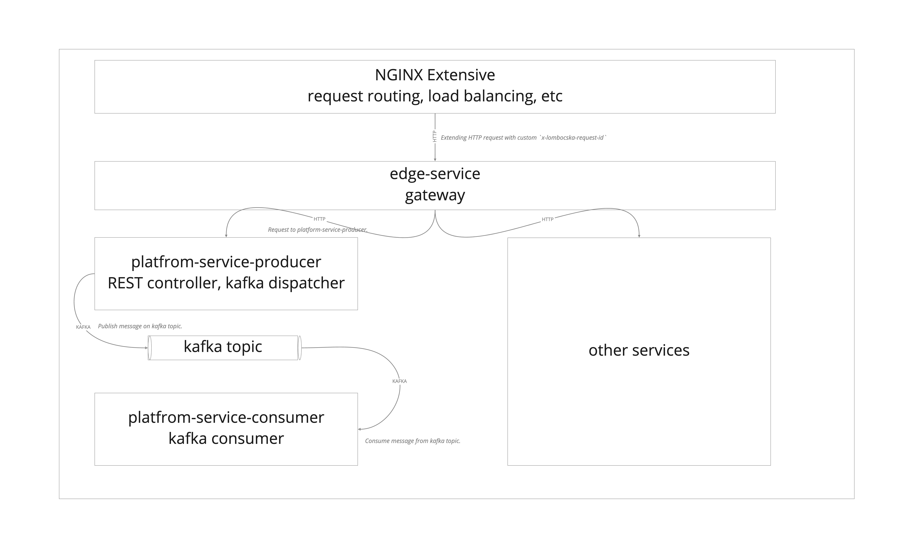
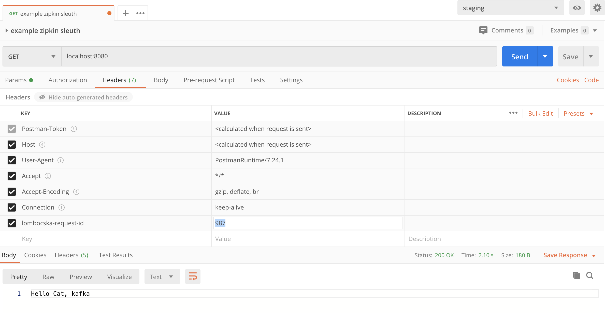
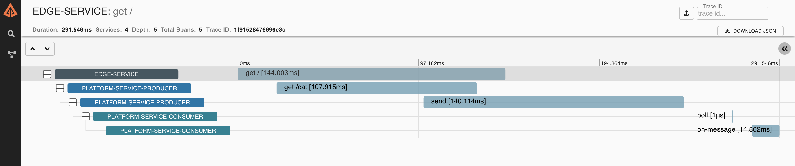
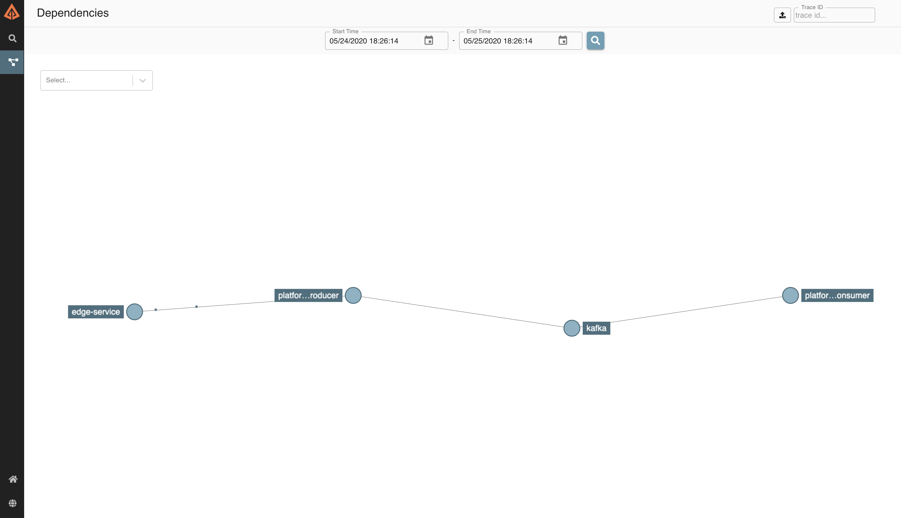
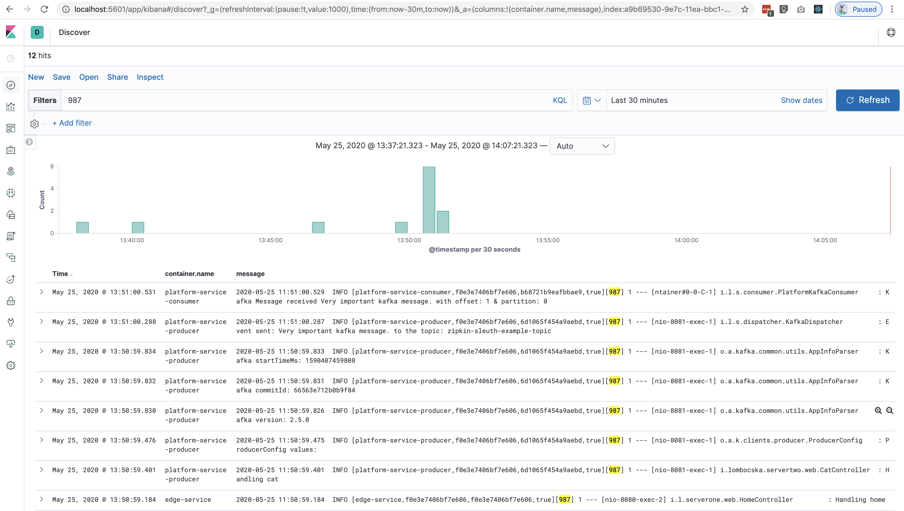

# Example for Spring Cloud Sleuth 

## Let's have a case, real-life example
 
You have microservices structured system with nginx. An x-super-request-id was introduced via nginx
and your team would like to apply `distributed tracing` and use the nginx custom trace id instead of the Spring Cloud Sleuth
generated traceId.  
Probably you have both HTTP and Messaging communication.

In microservices architecture, a single business operation might trigger a chain of downstream microservice calls 
and such interactions between the services can be challenging debugging. 

To make things easier, we can use Spring Cloud Sleuth + Zipkin(Brave) to enhance the application logs with tracing details.

## Overview




## MODULES

#### edge-service

Serving  GET request on `/` path. This request ends up with calling platform-service-producer via Feign on GET `/cat`
and returning its response.


#### platform-service-producer

Serving requests on `/cat` path and publish a message to kafka topic.


#### platform-service-consumer

Consuming messages from kafka topic and print them.


## GIST

POSTMAN request with custom trace id (in real-life, i.e.: nginx would generate this custom request id)




ZIPKIN Latency analysis




ZIPKIN Dependencies analysis/visualisation graph




ELK indices and tracing




## TECH STACK

- Java 11
- Spring Boot Framework
- Spring Cloud BOM (Hoxton.SR4)
- Spring Cloud Zipkin + Sleuth (2.2.2.RELEASE)
- Spring Cloud Feign
- docker-compose
- spotify maven dockerfile plugin
- ELK ( elasticsearch + logstash + kibana)

Both services use the dockerfile-maven plugin from Spotify to make the Docker build process integrate with the Maven build process. 
So when we build a Spring Boot artifact, we’ll also build a Docker image for it. 
For more details, check the Dockerfile and the pom.xml of each service.


## DEFINITIONS, TERMS

- `span id` The span represents a basic unit of work, for example sending an HTTP request.
- `trace id` The trace contains a set of spans, forming a tree-like structure. The trace id will remain the same as one microservice calls the next.
- `baggage field/propagation field` Baggage are fields that are propagated with the trace, optionally out of process. 
- `tags` Like trace IDs, Baggage is attached to messages or requests, usually as headers. Tags are key value pairs sent in a Span to Zipkin. 


```
Spring Cloud Sleuth is a distributed tracing solution and it adds a `trace id` and a `span id` to the logs.
Spring Cloud Sleuth provides Spring Boot auto-configuration for distributed tracing. 
Underneath, Spring Cloud Sleuth is a layer over a Tracer library named Brave.

Zipkin is a distributed tracing system. It helps gather timing data needed to troubleshoot latency problems in service architectures. 
Features include both the collection and lookup of this data
When you consider distributed tracing tracks requests, it makes sense that trace data can paint a picture of your architecture.
Zipkin includes a tool to build service dependency diagrams from traces, including the count of calls and how many errors exist.
```

[Documentation Link](https://cloud.spring.io/spring-cloud-static/spring-cloud-sleuth/2.0.1.RELEASE/single/spring-cloud-sleuth.html#_terminology)

## LOGGING

As the microservices will run in Docker containers, we can leave the responsibility of writing the log files to Docker. 
Filebeat & Logstash manage to deal with the logs coming form docker containers.

## USAGE


build docker latest images and jar

-  `cd docker/`
- `./build.sh` build docker images
-  `./start.sh` run docker containers

```
Note: zipkin-dependencies is an apache scheduled job, after finishing it will exit.
```


do the trigger action

- request `localhost:8080` with header request param `lombocska-request-id` with a value from i.e.: Postman


see the result in Kibana

- open `localhost:5601` in your browser
- Go to discover, create an index with pattern `logstash-*` then choose `@timestamp`
- in Kibana, Discover window you should be able to filter based on your custom trace id as well that you fill in as a value in `lombocska-request-id` header param


see the result in Zipkin

- open `http://localhost:9411/zipkin` Discover Page
- click search button
- you should see the different requests and messaging polls within a hierarchy structure
- visit `http://localhost:9411/zipkin/dependency` and see how the service graph looks like

At the end of the whole process call `./stop.sh` in docker folder.

## TO-DO
- [ ] in zipkin, custom trace id is not searchable as a tag (fix)
- [ ] lack of other services in any programming language (i.e.: python)
- [ ] hinder unnecessary trace data flooding with instrumentation and sampling policy
- [ ] webflux showcase
- [ ] sampler percentage to spring.sleuth.sampler.percentage: 1.0
- [ ] prometheus
